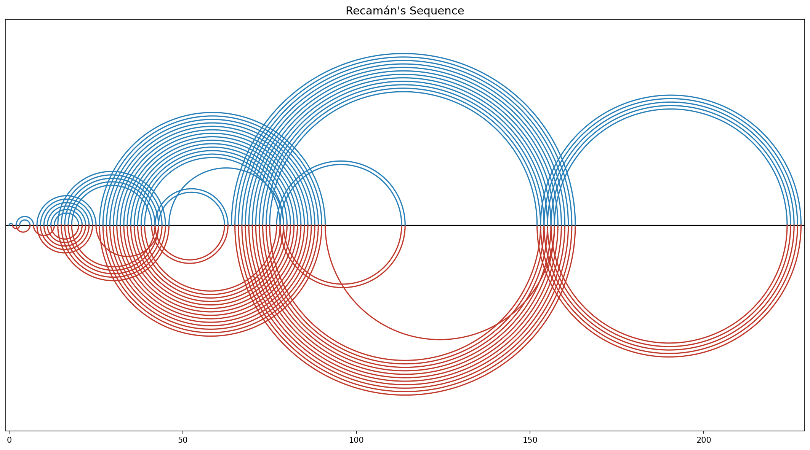
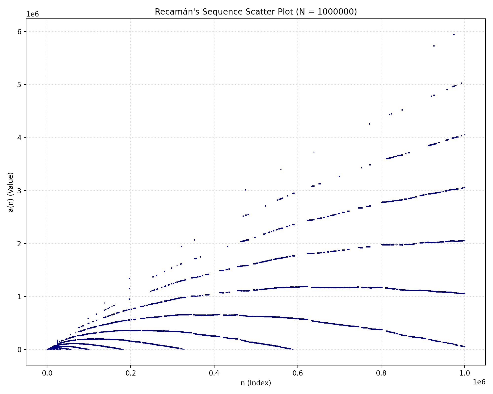
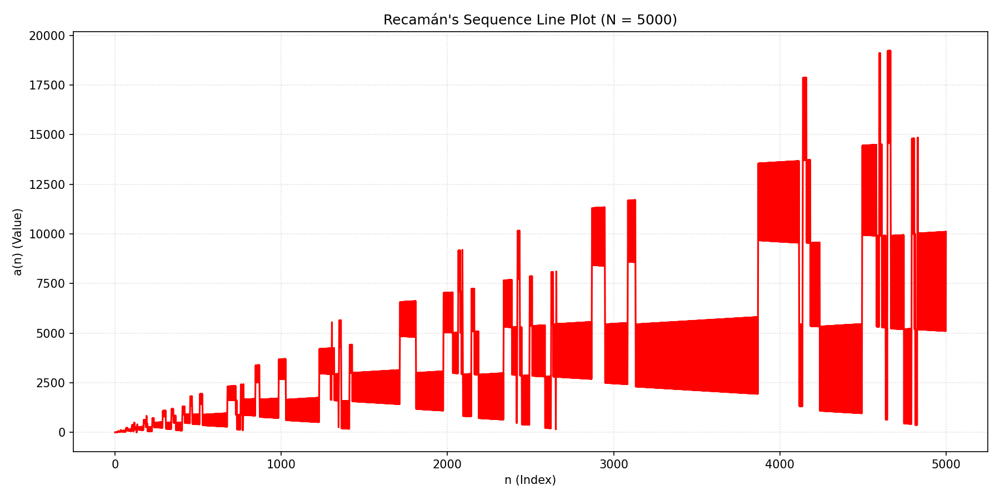

# Recamán Sequence

A modular Python project that generates, visualizes, sonifies, and analyzes
**Recamán's sequence** (OEIS [A005132](https://oeis.org/A005132)) — a deceptively
simple recurrence invented by the Colombian mathematician
*Bernardo Recamán Santos* and named one of his favorites by Neil Sloane,
founder of the OEIS.




---

## Mathematical Definition

The sequence is defined by the recurrence relation:

```
a(0) = 0
a(n) = a(n-1) - n   if  a(n-1) - n > 0  and  a(n-1) - n has not appeared before
a(n) = a(n-1) + n   otherwise
```

In short: **"subtract if you can, otherwise add."**

The first terms are:

```
0, 1, 3, 6, 2, 7, 13, 20, 12, 21, 11, 22, 10, 23, 9, 24, 8, 25, 43, 62, ...
```

The sequence satisfies two invariants: every term is non-negative, and the
absolute step between consecutive terms is always exactly `n`
(`|a(n) - a(n-1)| = n`).

### Why it is interesting

- **Visual beauty**
- **An open conjecture** — Sloane originally conjectured that every
  non-negative integer eventually appears in the sequence, but later recanted
  on its certainty. Despite more than 10²³⁰ computed terms, the question
  remains unresolved.
- **Musical structure** — the sequence sonifies naturally into recognizable
  melodic patterns when mapped onto musical scales.

---

## Project Structure

```
recaman-simulation/
├── README.md
├── requirements.txt
├── main.py                  # CLI entry point (argparse)
├── core/
│   ├── __init__.py
│   ├── sequence.py          # Sequence generation (list + lazy generator)
│   ├── visualizer.py        # Arc, scatter, frequency, line, and animation
│   ├── analyzer.py          # Statistical and number-theoretic analysis
│   └── audio.py             # Sonification (audification) to WAV
├── utils/
│   ├── __init__.py
│   └── io.py                # CSV / JSON persistence
├── tests/
│   └── test_sequence.py
└── outputs/                 # Generated artifacts (PNG / GIF / WAV / CSV)
```

### Module Responsibilities

| Module | Responsibility |
|---|---|
| `core/sequence.py` | Generate the sequence. Uses an auxiliary `set` for O(1) membership tests, giving overall **O(n)** time and O(n) memory. The naive `proposal not in list` check degrades to O(n²). |
| `core/visualizer.py` | Draw various visualizations: classic arcs, scatter plots, frequency mappings, and line charts. Produces animated GIFs with dynamic zoom and speed control. |
| `core/analyzer.py` | Compute basic statistics, find missing integers (relevant to the open coverage conjecture), and track first-occurrence indices. |
| `core/audio.py` | Map sequence values to frequencies on a chromatic (or alternative) scale and render a WAV file. |
| `utils/io.py` | Persist / load sequences as CSV or JSON. |
| `main.py` | Argparse-based CLI exposing every feature. |

---

## Usage

All features are exposed through a single CLI. Run from the project root:

```bash
python -m main --help
```

### Generate and visualize

```bash
# Plot the first 100 terms with alternating colors and display
python -m main -n 100 --png r100.png --stats --show

# Plot a vibrant rainbow arc visualization
python -m main -n 200 --png rainbow_200.png --rainbow

# Save a dynamic animation where the camera follows the sequence step-by-step
python -m main -n 100 --gif dynamic_rainbow_100.gif --dynamic --rainbow

# Create a slow animation (200ms delay between frames)
python -m main -n 100 --gif slow_100.gif --dynamic --interval 200

# Generate a scatter plot for 1,000,000 terms (efficient for large N)
python -m main -n 1000000 --scatter scatter_1M.png

# Plot the sequence values mapped to musical frequencies
python -m main -n 200 --freq freq_200.png --wav recaman_200.wav

# Plot a standard line chart of raw values
python -m main -n 100 --line line_100.png

# Export 10,000 terms and check which integers in [0, 200) are missing
python -m main -n 10000 --csv seq.csv --missing 200
```

### CLI reference

| Flag | Description |
|---|---|
| `-n, --terms INT` | Number of terms to generate (default: `100`). |
| `--csv PATH` | Write the sequence to a CSV file (`index,value`). |
| `--json PATH` | Write the sequence to a JSON file. |
| `--png PATH` | Save the classic arc visualization as a PNG image. |
| `--scatter PATH` | Save a scatter plot (recommended for large N > 10,000). |
| `--freq PATH` | Save a frequency mapping plot (visualizes sonification data). |
| `--line PATH` | Save a connected line plot of raw values vs. index. |
| `--gif PATH` | Save an animated GIF of the arcs being drawn. |
| `--wav PATH` | Sonify the sequence into a WAV audio file. |
| `--rainbow` | Color each arc with a different vibrant color based on its index. |
| `--dynamic` | Dynamic zoom-out for GIFs. The camera view expands step-by-step. |
| `--interval INT` | Delay between frames in GIF in milliseconds (default: `50`, lower=faster, higher=slower). |
| `--stats` | Print summary statistics (min, max, mean, std, unique count). |
| `--missing K` | Print integers in `[0, K)` that do **not** appear in the sequence. |
| `--show` | Display the matplotlib window interactively. |

---

## Sample Outputs

Here are some examples of what the simulator can produce. *(Replace these with your own generated image links)*

### 1. Classic Arc Visualization (PNG)
Standard alternating top/bottom arcs over a number line.

### 2. Dynamic Rainbow Animation (GIF)
The camera starts zoomed in and dynamically zooms out as the sequence grows.


### 3. Scatter Plot (PNG)
Efficient visualization for large N (e.g., 1,000,000 terms).


### 4. Line Plot (PNG)
Raw values of the sequence plotted as a connected line chart.


---

## Example Output

### `--stats` for `n = 100`

```
   n_terms: 100
       min: 0
       max: 199
      mean: 73.41
       std: 49.12
    unique: 100
```

### First 12 terms (regression check)

```
[0, 1, 3, 6, 2, 7, 13, 20, 12, 21, 11, 22]
```

This matches the canonical values listed in OEIS and Wolfram MathWorld.

---

## Algorithmic Notes

### Why use an auxiliary `set`?

A naive implementation checks membership with `proposal not in list`, which is
O(n) per step and makes the whole generation **O(n²)**. Maintaining a parallel
`set` of seen values reduces membership tests to **O(1)** amortized, bringing
the total cost to **O(n)**. This matters sharply when `n` grows past ~10⁴:

| n | Naive (`not in list`) | With `set` |
|---:|---:|---:|
| 1,000 | ~0.05 s | ~0.001 s |
| 10,000 | ~4 s | ~0.01 s |
| 100,000 | ~7 min | ~0.1 s |

### Dynamic Zoom Logic

In Recamán's sequence, the step size at iteration `n` is exactly `n`. Therefore, the radius of the arc drawn at step `n` is always `n/2`. The `--dynamic` flag leverages this mathematical property: at frame `i`, it calculates the maximum value reached so far and sets the y-axis limits to `±(i/2)`, creating a smooth, step-by-step camera movement that perfectly tracks the drawing.

### High-water marks

The points where the sequence reaches a new maximum are themselves an OEIS
sequence (the "high-water marks"): `1, 4, 131, 99734, 181653, ...`

---

## Extension Paths

1. **Generalized Recamán sequences** — Implement the "cousins" described by
   Alekseyev, Myers, Schroeppel, Shannon, Sloane, and Zimmermann, such as
   *Blanes-Mollís* or the doubly-additive variant.
2. **Coverage-conjecture experiments** — Generate 10⁵–10⁶ terms, partition
   `[0, K)` into buckets, and track how the set of missing integers evolves.
   Useful empirical evidence for the open conjecture.
3. **Performance benchmarking** — Compare the naive O(n²) implementation
   against the `set`-based O(n) version and plot runtime vs. `n`.
4. **Interactive web visualization** — Port `visualizer.py` to `p5.js` for a
   live, browser-based experience (see The Coding Train's Challenge #110).
5. **Musical scale exploration** — Replace the chromatic mapping in
   `core/audio.py` with major, minor, pentatonic, or blues scales and compare
   the resulting melodic character.

---

## Testing

```bash
python -m unittest discover tests
```

`tests/test_sequence.py` verifies:

- The first 12 terms match the canonical sequence.
- The first 1000 terms contain no duplicates.
- All terms are non-negative.

---

## References & Resources

### 1. Primary Databases & Formal Definitions
| Resource | Link | Description |
|:---|:---|:---|
| **OEIS A005132** | [oeis.org/A005132](https://oeis.org/A005132) | The official On-Line Encyclopedia of Integer Sequences entry. Contains the definition, millions of terms, graphs, and cross-references. |
| **OEIS Wiki** | [oeis.org/wiki/Recamán's_sequence](https://oeis.org/wiki/Recam%C3%A1n%27s_sequence) | Detailed wiki page within OEIS discussing the history, rules, and open conjectures. |
| **Wolfram MathWorld** | [mathworld.wolfram.com/RecamansSequence.html](https://mathworld.wolfram.com/RecamansSequence.html) | A rigorous mathematical overview including high-water marks and alternative formulations. |
| **Wikipedia** | [en.wikipedia.org/wiki/Recamán's_sequence](https://en.wikipedia.org/wiki/Recam%C3%A1n%27s_sequence) | General overview, history, and the classic Edmund Harriss arc visualization. |

### 2. Key Articles & Analysis
| Resource | Link | Description |
|:---|:---|:---|
| **Cleve Moler (MathWorks)** | [blogs.mathworks.com/.../the-oeis-and-the-recaman-sequence](https://blogs.mathworks.com/cleve/2018/07/09/the-oeis-and-the-recaman-sequence) | Excellent analysis of sequence complexity, coverage conjecture, and MATLAB implementation by the creator of MATLAB. |
| **John D. Cook** | [johndcook.com/blog/2025/05/05/recamans-sequence](https://www.johndcook.com/blog/2025/05/05/recamans-sequence) | Concise explanation and Python code for generating the classic arc visualization. |
| **Science Spectrum** | [sciencespectrumu.com/.../ultimate-guide-to-recamáns-sequence](https://sciencespectrumu.com/the-ultimate-guide-to-recam%C3%A1ns-sequence-874cdbb28a4a) | An in-depth guide focusing on the intersection of the sequence's mathematical properties and its sonification. |

### 3. Academic & Research Papers
| Resource | Link | Description |
|:---|:---|:---|
| **Three Cousins of Recamán's Sequence** | [fq.math.ca/Papers/60-3/sloane05292021v2.pdf](https://www.fq.math.ca/Papers/60-3/sloane05292021v2.pdf) | A research paper by N.J.A. Sloane and others exploring variants and generalizations of the sequence. |
| **A Handbook of Integer Sequences (50 Years Later)** | [link.springer.com/article/10.1007/s00283-023-10266-6](https://link.springer.com/article/10.1007/s00283-023-10266-6) | Sloane's retrospective on the OEIS, featuring Recamán's sequence as a notable example of an intriguing, unsolved problem. |

### 4. Video & Multimedia
| Resource | Link | Description |
|:---|:---|:---|
| **Numberphile: The Slightly Spooky Recamán Sequence** | [youtube.com/watch?v=DhFZfzOvNTU](https://www.youtube.com/watch?v=DhFZfzOvNTU) | The viral Numberphile video featuring Edmund Harriss, which popularized the sequence and its arc visualization. |
| **The Coding Train: Coding Challenge #110** | [thecodingtrain.com/challenges/110-recamans-sequence](https://thecodingtrain.com/challenges/110-recamans-sequence) | Daniel Shiffman's implementation of the visualization and sonification in JavaScript (p5.js). Great for porting concepts. |
| **Mr. P Solver: This Sequence of Numbers SOUNDS Good** | [youtube.com/watch?v=aGVWXhINpTE](https://www.youtube.com/watch?v=aGVWXhINpTE) | A detailed Python tutorial on sonifying the sequence using different musical scales. |

### 5. Code Repositories & Implementations
| Resource | Link | Description |
|:---|:---|:---|
| **Christian Hill (scipython)** | [scipython.com/blog/recamans-sequence](https://scipython.com/blog/recamans-sequence) | A clean Python implementation using the walrus operator (`:=`) and matplotlib for the arc drawing. |
| **Rosetta Code** | [rosettacode.org/wiki/Recaman's_sequence](https://rosettacode.org/wiki/Recaman%27s_sequence) | Implementations of the sequence generator in dozens of different programming languages. |
| **ignaeche/recaman-sequence (GitHub)** | [github.com/ignaeche/recaman-sequence](https://github.com/ignaeche/recaman-sequence) | A Python 3 script for generating images and animations of the sequence using matplotlib and tqdm. |

